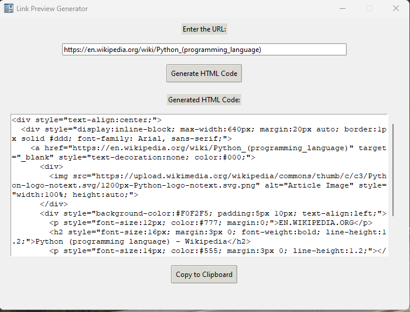

# Link Preview Generator

A simple tool to generate HTML embed code for URL previews. Ideal for platforms like Squarespace that don’t reliably auto-generate URL previews.

## Features
- Extracts Open Graph metadata from URLs to create HTML embed code.
- Displays a preview similar to social media previews with title, description, and image.
- Offers both a standalone executable for easy use and the Python source code for customization.

## Installation and Usage

### Quick Start with Executable
1. Download the executable from the `dist/` folder: [Link Preview Generator.exe](./dist/Link%20Preview%20Generator.exe).
2. Run `Link Preview Generator.exe`.
3. Enter a URL and generate the HTML code, ready for embedding.

### Run from Source Code
1. Clone the repository:
    ```bash
    git clone https://github.com/yourusername/Link-Preview-Generator.git
    ```
2. Install dependencies:
    ```bash
    pip install -r requirements.txt
    ```
3. Run the script:
    ```bash
    python src/link_preview_generator.py
    ```

## Screenshots
Here’s how the Link Preview Generator looks in action:


*How the GUI appears after pasting in a URL*


*The result after pasting the generated code on a website*

## Contributing
Contributions are welcome! Submit pull requests or open issues to improve the tool.

## License
This project is licensed under the MIT License - see the [LICENSE](./LICENSE) file for details.

